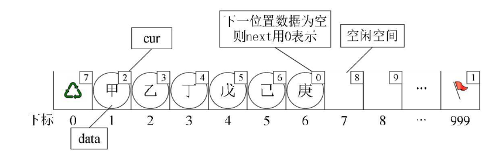
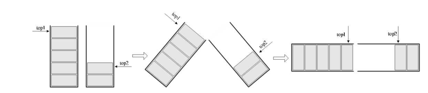

# 线性表抽象数据定义

```
Data（有固定的前后驱元素）
Operation
    InitList(*L)       //初始化空的线性表
    ListEmpty(L)       //检查线性表是否为空
    ClearList(*L)      //清空线性表
    LocateElem(L,e)    //寻找元素1,若存在返回位置
    GetElem(L,i,*e)    //将第i个元素赋值给e
```
## 顺序储存结构
```
#define MAXSIZE 20
typedef int ElemType;
typedef struct
{
    //data储存空间初始位置
    //MAXSIZE最大储存
    //lenth长度（<=MAXSIZE）
    ElemType data[MAXSIZE];
    int lenth;
}SqList;
```
元素位置

***

# 元素的插入和删除
获得元素
```
#define OK 1
#define ERROR 0
#define TRUE 1
#define FALSE 0
typedef int Status;
/* Status是函数的类型，其值是函数结果状态代
码，如OK等 */
/* 初始条件：顺序线性表L已存在，1≤i≤
ListLength(L) */
/* 操作结果：用e返回L中第i个数据元素的值 */
Status GetElem(SqList L, int i, ElemType *e)
{
if (L.length == 0 || i < 1 ||
i > L.length)
return ERROR;
*e = L.data[i - 1];
return OK;
}
```
插入操作
```
/* 初始条件：顺序线性表L已存在，1≤i≤
ListLength(L)， */
/* 操作结果：在L中第i个位置之前插入新的数据元
素e，L的长度加1 */
Status ListInsert(SqList *L, int i, ElemType e)
{
int k;
/* 顺序线性表已经满 */
if (L->length == MAXSIZE)
return ERROR;
/* 当i不在范围内时 */
if (i < 1 || i >L->length + 1)
return ERROR;
/* 若插入数据位置不在表尾 */
if (i <= L->length)
{
/*将要插入位置后数据元素向后移动一位 */
for (k = L->length - 1; k >= i - 1; k--)
L->data[k + 1] = L->data[k];
}
/* 将新元素插入 */
L d t [i
1]L->data[i - 1] = e;
L->length++;
return OK;
}
```
删除操作
```
/* 初始条件：顺序线性表L已存在，1≤i≤
ListLength(L) */
/* 操作结果：删除L的第i个数据元素，并用e返回其值，L的长度减1 */
Status ListDelete(SqList *L, int i, ElemType *e)
{
int k;
/* 线性表为空 */
if (L->length == 0)
return ERROR;
/* 删除位置不正确 */
if (i < 1 || i > L->length)
return ERROR;
*e = L->data[i - 1];
/* 如果删除不是最后位置 */
if (i < L->length)
{
/* 将删除位置后继元素前移 */
for (k = i; k < L->length; k++)
L->data[k - 1] = L->data[k];
}
L->length--;
return OK;
}
```
读取，存储O(1),删除，插入O(n)
***

# 链式储存结构
```

```

## 线性表链式存储结构代码描述
```
/* 线性表的单链表存储结构 */
typedef struct Node
{
ElemType data;
struct Node *next;
} Node;
/* 定义LinkList */
typedef struct Node *LinkList;
```
## 单链表的读取
```
/* 初始条件：顺序线性表L已存在，1≤i≤
ListLength(L) */
/* 操作结果：用e返回L中第i个数据元素的值 */
Status GetElem(LinkList L, int i, ElemType *e)
{
int j;
LinkList p;
/* 声明一指针p */
p = L->next;
/* 让p指向链表L的第1个结点 */
j = 1;
/* j为计数器 */
/* p不为空且计数器j还没有等于i时，循环继续 */
while (p && j < i)
{
p = p->next;
/* 让p指向下一个结点 */
++j;
}
if (!p || j > i)
return ERROR;
*e = p->data;
return OK;
/* 第i个结点不存在 */
/* 取第i个结点的数据 */
}
O(n)
```
# 单链表的插入与删除
```
//插入
s->next = p->next; p->next = s;

定位插入
/* 初始条件：顺序线性表L已存在，1≤i≤
ListLength(L)， */
/* 操作结果：在L中第i个结点位置之前插入新的数
据元素e，L的长度加1 */
Status ListInsert(LinkList *L, int i, ElemType e)
{
int j;
LinkList p, s;
p = *L;
j = 1;
/* 寻找第i-1个结点 */
while (p && j < i)
{
p = p->next;
++j;
}
/* 第i个结点不存在 */
if (!p || j > i)
return ERROR;
/* 生成新结点（C标准函数） */
s = (LinkList)malloc(sizeof(Node));
s->data = e;
/* 将p的后继结点赋值给s的后继 */
s->next = p->next;/* 将s赋值给p的后继 */
p->next = s;
return OK;
}
```
```
//删除
q=p->next; p->next=q->next;

//定位删除
/* 初始条件：顺序线性表L已存在，1≤i≤
ListLength(L) */
/* 操作结果：删除L的第i个结点，并用e返回其
值，L的长度减1 */
Status ListDelete(LinkList *L, int i, ElemType *e)
{
int j;
LinkList p, q;
p = *L;
j = 1;
/* 遍历寻找第i-1个结点 */
while (p->next && j < i)
{
p = p->next;
++j;
}
/* 第i个结点不存在 */
if (!(p->next) || j > i)
return ERROR;
q = p->next;
/* 将q的后继赋值给p的后继 */
p->next = q->next;
/* 将q结点中的数据给e */
*e = q->data;
/* 让系统回收此结点，释放内存 */
free(q);
return OK;
}

//O(n)
```

```
//单链表的整表创建
/* 随机产生n个元素的值，建立带表头结点的单链
线性表L（头插法） */
void CreateListHead(LinkList *L, int n)
{
LinkList p;
int i;
/* 初始化随机数种子 */srand(time(0));
*L = (LinkList)malloc(sizeof(Node));
/* 先建立一个带头结点的单链表 */
(*L)->next = NULL;
for (i = 0; i < n; i++)
{
/* 生成新结点 */
p = (LinkList)malloc(sizeof(Node));
/* 随机生成100以内的数字 */
p->data = rand() % 100 + 1;
p->next = (*L)->next;   //！！！
/* 插入到表头 */
(*L)->next = p;
}
}
/* 随机产生n个元素的值，建立带表头结点的单链
线性表L（尾插法） */
void CreateListTail(LinkList *L, int n)
{
LinkList p,r;
int i;
/* 初始化随机数种子 */
srand(time(0));
/* 为整个线性表 */
*L = (LinkList)malloc(sizeof(Node));
/* r为指向尾部的结点 */
r = *L;
for (i = 0; i < n; i++)
{
/* 生成新结点 */
p = (Node *)malloc(sizeof(Node));
/* 随机生成100以内的数字 */
p->data = rand() % 100 + 1;
/* 将表尾终端结点的指针指向新结点 */
r->next = p;
/* 将当前的新结点定义为表尾终端结点 */
r = p;
}
/* 表示当前链表结束 */
r->next = NULL;
}
```


```
//单链表的整表删除

Status ClearList(LinkList *L)
{
LinkList p, q;
/* p指向第一个结点 */
p = (*L)->next;
/* 没到表尾 */
while (p)
{
q = p->next;
free(p);
p=q;
}
/* 头结点指针域为空 */(*L)->next = NULL;
return OK;
}
```

# 静态链表
```
#define MAXSIZE 1000
typedef struct
{
ElemType data;
/* 游标（Cursor），为0时表示无指向 */
int cur;
} Component,
/* 对于不提供结构struct的程序设计语言，
可以使用一对并行数组data和cur来处理。 */
StaticLinkList[MAXSIZE];
```
```
//初始化静态数组
Status InitList(StaticLinkList space)
{
int i;
for (i = 0; i < MAXSIZE - 1; i++)
space[i].cur = i + 1;
/* 目前静态链表为空，最后一个元素的cur为0 */
space[MAXSIZE - 1].cur = 0;
return OK;
}
//数组第一个元素，即下标为0的元素的cur就存放备用链表的第一个结点的下标；而数组的最后一个元素的cur则存放第一个有数值的元素的下标，初始时为0
```


```
//长度获取
int ListLength(StaticLinkList L)
{
int j = 0;
int i = L[MAXSIZE - 1].cur;
while (i)
{i = L[i].cur;
j++;
}
return j;
}
```
## 静态数组的插入
```
int Malloc_SLL(StaticLinkList space)
{
/* 当前数组第一个元素的cur存的值， */
/* 就是要返回的第一个备用空闲的下标 */
int i = space[0].cur;
/* 由于要拿出一个分量来使用了，所以我们 */
/* 就得把它的下一个分量用来做备用 */
if (space[0].cur)
space[0].cur = space[i].cur;
return i;
}

/* 在L中第i个元素之前插入新的数据元素e */
Status ListInsert(StaticLinkList L, int i, ElemType)
{
int j, k, l;
/* 注意k首先是最后一个元素的下标 */
k = MAX_SIZE - 1;
if (i < 1 || i > ListLength(L) + 1)
return ERROR;
/* 获得空闲分量的下标 */
j = Malloc_SSL(L);
if (j)
{
/* 将数据赋值给此分量的data */
L[j].data = e;
/* 找到第i个元素之前的位置 */
for (l = 1; l <= i - 1; l++)
k = L[k].cur;
/* 把第i个元素之前的cur赋值给新元素的cur */
L[j].cur = L[k].cur;
/* 把新元素的下标赋值给第i个元素之前元素的cur */
L[k].cur = j;
return OK
}
return ERROR;
}
```
## 静态数组的删除
```
/* 将下标为k的空闲结点回收到备用链表 */void Free_SSL(StaticLinkList space, int k)
{
/* 把第一个元素cur值赋给要删除的分量cur */
space[k].cur = space[0].cur;
/* 把要删除的分量下标赋值给第一个元素的cur */
space[0].cur = k;
}

Status ListDelete(StaticLinkList L, int i)
{
int j, k;
if (i < 1 || i > ListLength(L))
return ERROR;
k = MAX_SIZE - 1;
for (j = 1; j <= i - 1; j++)
k = L[k].cur;
j = L[k].cur;
L[k].cur = L[j].cur;
Free_SSL(L, j);
return OK;
}
```

# 循环链表

改进版


```
//合并循环链表
/* 保存A表的头结点，即① */
p = rearA->next;
/*将本是指向B表的第一个结点（不是头结点） */
rearA->next = rearB->next->next;
/* 赋值给reaA->next，即② */
q = rearB->next;
/* 将原A表的头结点赋值给rearB->next，即③ */
rearB->next = p;
/* 释放q */
free(q);
```
## 双向链表
```
/* 线性表的双向链表存储结构 */
typedef struct DulNode
{
ElemType data;
struct DuLNode *prior;
struct DuLNode *next;
} DulNode, *DuLinkList;
```

```
//插入
/*把p赋值给s的前驱，如图中① */
s->prior = p;
/* 把p->next赋值给s的后继，如图中② */
s->next = p->next;
/* 把s赋值给p->next的前驱，如图中③ */
p->next->prior = s;
/* 把s赋值给p的后继，如图中④ */
p->next = s;
```

```
//删除
/* 把p->next赋值给p->prior的后继，如图中① */
p->prior->next = p->next;
/* 把p->prior赋值给p->next的前驱，如图中② */
p->next->prior = p->prior;
/* 释放结点 */
free(p);
```


***

# 栈和队列

栈是限定仅在表尾进行插入和删除操作的线性表。
队列是只允许在一端进行插入操作、而在另一端进行删除操作的线性表。

```
栈的抽象数据类型
ADT 栈(stack)
Data
同线性表。元素具有相同的类型，相邻元素具有前驱和后继关系
Operation
InitStack(*S):
初始化操作，建立一个空栈S。
DestroyStack(*S): 若栈存在，则销毁它。
ClearStack(*S):
将栈清空。
StackEmpty(S):
若栈为空，返回true，否则返回false
GetTop(S, *e):
若栈存在且非空，用e返回S的栈顶元素
Push(*S, e):
若栈S存在，插入新元素e到栈S中并成
Pop(*S, *e):
删除栈S中栈顶元素，并用e返回其值。
StackLength(S):
返回栈S的元素个数。
```
## 栈的顺序存储结构
```
/* SElemType类型根据实际情况而定，这里假设为int */
typedef int SElemType;
typedef struct
{
SElemType data[MAXSIZE];
/* 用于栈顶指针 */
int top;
}SqStack;
```
## 进栈和出栈
```
/* 插入元素e为新的栈顶元素 */
Status Push(SqStack *S, SElemType e)
{
/* 栈满 */
if (S->top == MAXSIZE - 1)
{
return ERROR;
}
/* 栈顶指针增加一 */
S->top++;
/* 将新插入元素赋值给栈顶空间 */
S->data[S->top] = e;
return OK;
}


/* 若栈不空，则删除S的栈顶元素，用e返回其值，
并返回OK；否则返回ERROR */
Status Pop(SqStack *S, SElemType *e)
{
if (S->top == -1)
return ERROR;
/* 将要删除的栈顶元素赋值给e */
*e = S->data[S->top];
/* 栈顶指针减一 */
S->top--;
return OK;
}
```

# 两栈共享空间
```
typedef struct
{
SElemType data[MAXSIZE];
int top1;
/* 栈1栈顶指针 */
int top2;
/* 栈2栈顶指针 */
} SqDoubleStack;
```


## 插入和删除
```
/* 插入元素e为新的栈顶元素 */
Status Push(SqDoubleStack *S, SElemType e,
int stackNumber)
{
/* 栈已满，不能再push新元素了 */
if (S->top1 + 1 == S->top2)
return ERROR;
/* 栈1有元素进栈 */
if (stackNumber == 1)
/* 若栈1则先top1+1后给数组元素赋值 */
S->data[++S->top1] = e;
/* 栈2有元素进栈 */
else if (stackNumber == 2)
/* 若栈2则先top2-1后给数组元素赋值 */
S->data[--S->top2] = e;
return OK;
}


/* 若栈不空，则删除S的栈顶元素，用e返回其值，并返回OK；否则返回ERROR */
Status Pop (SqDoubleStack *S, SElemType *e, int stackNumber）
{
if (stackNumber == 1)
{
/* 说明栈1已经是空栈，溢出 */
if (S->top1 == -1)
return ERROR;
/* 将栈1的栈顶元素出栈 */
*e = S->data[S->top1--];
}
else if (stackNumber == 2)
{
/* 说明栈2已经是空栈，溢出 */
if (S->top2 == MAXSIZE)
return ERROR;
/* 将栈2的栈顶元素出栈 */
*e = S->data[S->top2++];
}
return OK;
}
```

***

# 链式储存结构


```
typedef struct StackNode
{
SElemType data;
struct StackNode *next;
} StackNode, *LinkStackPtr;
typedef struct LinkStack
{
LinkStackPtr top;
int count;
} LinkStack;
```

## 进栈和出栈
```
/* 插入元素e为新的栈顶元素 */
Status Push(LinkStack *S, SElemType e)
{
LinkStackPtr s
= (LinkStackPtr)malloc(sizeof(StackNode));
s->data = e;
/* 把当前的栈顶元素赋值给新结点的直接后继，如图中① */
s->next = S->top;
/* 将新的结点s赋值给栈顶指针，如图中② */
S->top = s;
S->count++;
return OK;
}

/* 若栈不空，则删除S的栈顶元素，用e返回其值，
并返回OK；否则返回ERROR */
Status Pop(LinkStack *S, SElemType *e)
{
LinkStackPtr p;
if (StackEmpty(*S))
return ERROR;
*e = S->top->data;
/* 将栈顶结点赋值给p，如图③ */
p = S->top;
/* 使得栈顶指针下移一位，指向后一结点，如图④ */
S->top = S->top->next;
/* 释放结点p */
free(p);
S->count--;
return OK;
}
```
***

# 队列
队列（queue）是只允许在一端进行插入操作，而在另一端进行删除操作的线性表。
队列是一种先进先出（First In First Out）的线性表，简称FIFO。允许插入的一端称为队尾，允许删除的一端称为队头。


## 队列的抽象数据类型
```
ADT 队列(Queue)
Data
同线性表。元素具有相同的类型，相邻元素具有前驱和后继关系
Operation
InitQueue(*Q):
初始化操作，建立一个空队列Q。
DestroyQueue(*Q): 若队列Q存在，则销毁它。
ClearQueue(*Q):
将队列Q清空。
QueueEmpty(Q):
若队列Q为空，返回true，否则返回false
GetHead(Q, *e):
若队列Q存在且非空，用e返回队列Q的头部
EnQueue(*Q, e):
若队列Q存在，插入新元素e到队列Q中
DeQueue(*Q, *e): 删除队列Q中队头元素，并用e返回其值
QueueLength(Q):
返回队列Q的元素个数
```

## 循环队列
判断对满


```
//顺序结构循环队列
/* QElemType类型根据实际情况而定，这里假设为int */
typedef int QElemType;
/* 循环队列的顺序存储结构 */
typedef struct
{
QElemType data[MAXSIZE];
/* 头指针 */
int front;
/* 尾指针，若队列不空，
指向队列尾元素的下一个位置 */
int rear;
} SqQueue;


//初始化
/* 初始化一个空队列Q */
Status InitQueue(SqQueue *Q)
{
Q->front = 0;
Q->rear = 0;
return OK;
}


//求长
/* 返回Q的元素个数，也就是队列的当前长度 */
int QueueLength(SqQueue Q)
{
return (Q.rear - Q.front + MAXSIZE) % MAXSIZE;
}


//入队
/* 若队列未满，则插入元素e为Q新的队尾元素 */
Status EnQueue(SqQueue *Q, QElemType e)
{
/* 队列满的判断 */
if ((Q->rear + 1) % MAXSIZE == Q->front)
return ERROR;
/* 将元素e赋值给队尾 */
Q->data[Q->rear] = e;
/* rear指针向后移一位置， */
Q->rear = (Q->rear + 1) % MAXSIZE;  //！！！
/* 若到最后则转到数组头部 */
return OK;
}


//出对
/* 若队列不空，则删除Q中队头元素，用e返回其值 */
Status DeQueue(SqQueue *Q, QElemType *e)
{
/* 队列空的判断 */
if (Q->front == Q->rear)
return ERROR;
/* 将队头元素赋值给e */
*e = Q->data[Q->front];
/* front指针向后移一位置， */
Q->front = (Q->front + 1) % MAXSIZE;
/* 若到最后则转到数组头部 */
return OK;
}
```
***

```
链式结构循环队列
/* QElemType类型根据实际情况而定，这里假设为int */
typedef int QElemType;
/* 结点结构 */typedef struct QNode
{
QElemType data;
struct QNode *next;
} QNode, *QueuePtr;
/* 队列的链表结构 */
typedef struct
{
/* 队头、队尾指针 */
QueuePtr front, rear;
} LinkQueue;


//插入
/* 插入元素e为Q的新的队尾元素 */
Status EnQueue(LinkQueue *Q, QElemType e)
{
QueuePtr s =
(QueuePtr)malloc(sizeof(QNode));
/* 存储分配失败 *// 存储分配失败 /
if (!s)
exit(OVERFLOW);
s->data = e;
s->next = NULL;
/* 把拥有元素e新结点s赋值给原队尾结点的后继， */
Q->rear->next = s;
/* 见上图中① */
/* 把当前的s设置为队尾结点，rear指向s，见上图中② */
Q->rear = s;
return OK;
}


//出队
/* 若队列不空，删除Q的队头元素，用e返回其值，
并返回OK，否则返回ERROR */
Status DeQueue(LinkQueue *Q, QElemType *e)
{
QueuePtr p;Q
p;
if (Q->front == Q->rear)
return ERROR;
/* 将欲删除的队头结点暂存给p，见上图中① */
p = Q->front->next;
/* 将欲删除的队头结点的值赋值给e */
*e = p->data;
/* 将原队头结点后继p->next赋值给头结点后继， */
Q->front->next = p->next;
/* 见上图中② */
/* 若队头是队尾，则删除后将rear指向头结点，见上图中③
if (Q->rear == p)
Q->rear = Q->front;
free(p);
return OK;
}
```
***

# 串
串（string）是由零个或多个字符组成的有限序列，又名叫字符串

```
ADT 串(string)
Data
串中元素仅由一个字符组成，相邻元素具有前驱和后继关系。
Operation
StrAssign(T, *chars):
生成一个其值等于字符串
StrCopy(T, S):
串S存在，由串S复制得
ClearString(S):
串S存在，将串清空。
StringEmpty(S):
若串S为空，返回true
StrLength(S):
返回串S的元素个数，即
StrCompare(S, T):
若S>T，返回值>0，若S
Concat(T, S1, S2):
用T返回由S1和S2联接而
SubString(Sub, S, pos, len): 串S存在，1≤pos≤Str
且0≤len≤StrLength
回串S的第pos个字符起
Index(S, T, pos):
串S和T存在，T是非空串
若主串S中存在和串T值
第pos个字符之后第一次
Replace(S, T, V):
串S、T和V存在，T是非
与T相等的不重叠的子串
StrInsert(S, pos, T):
串S和T存在，1≤pos≤S
在串S的第pos个字符之StrDelete(S, pos, len):
串S存在，1≤pos≤Str
从串S中删除第pos个字
```

## kmp模式匹配算法


# 树
树（Tree）是n（n≥0）个结点的有限集。n=0时称为空树。在任意一棵非空树中：（1）有且仅有一个特定的称为根（Root）的结点；
（2）当n＞1时，其余结点可分为m（m＞0）个互不相交的有限集T1、T2、……、Tm，其中每一个集合本身又是一棵树，并且称为根的子树（SubTree）。
n>0时根结点是唯一的，不可能存在多个根结点


树的结点包含一个数据元素及若干指向其子树的分支。结点拥有的子树数称为结点的度（De-gree）。度为0的结点称为叶结点（Leaf）或终端结点；度不为0的结点称为非终端结点或分支结点。除根结点之外，分支结点也称为内部结点。树的度是树内各结点的度的最大值。如图6-2-4所示，因为这棵树结点的度的最大值是结点D的度，为3，所以树的度也为3。


结点的子树的根称为该结点的孩子（Child），相应地，该结点称为孩子的双亲（Parent）

结点的层次（Level）从根开始定义起，根为第一层，根的孩子为第二层。若某结点在第l层，则其子树就在第l+1层。


## 树的抽象数据结构
```
Data
树是由一个根结点和若干棵子树构成。树中结点具有相同数据类
Operation
InitTree(*T)`：初始化树，将树指针 `T` 指向 `NULL`。
- `DestroyTree(*T)`：销毁树，递归地释放所有结点的内存。
- `CreateTree(*T, definition)`：根据给定的定义创建树，为树的根结点分配内存，并设置数据值。
- `ClearTree(*T)`：清空树，调用 `DestroyTree` 函数销毁树。
- `TreeEmpty(T)`：判断树是否为空树，如果树指针 `T` 为 `NULL`，返回 `true`。
- `TreeDepth(T)`：返回树的深度，递归地计算树的子树的最大深度。
- `Root(T)`：返回树的根结点，即返回树指针 `T`。
- `Value(T, cur_e)`：返回结点的值，即返回结点 `cur_e` 的数据值。
- `Assign(T, cur_e, value)`：给结点赋值，将结点 `cur_e` 的数据值设置为 `value`。
- `Parent(T, cur_e)`：返回结点的父结点，递归地查找结点 `cur_e` 的父结点。
- `LeftChild(T, cur_e)`：返回结点的第一个子结点，即返回结点 `cur_e` 的 `firstChild` 指针指向的结点。
- `RightSibling(T, cur_e)`：返回结点的右兄弟结点，即返回结点 `cur_e` 的 `nextSibling` 指针指向的结点。
- `InsertChild(*T, *p, i, c)`：在指定结点插入子树，将子树 `c` 插入结点 `p` 的第 `i` 个位置。
- `DeleteChild(*T, *p, i)`：删除指定结点的第 `i` 个子树，释放被删除的子树的内存。
```

```
typedef struct TreeNode {
    int data;
    struct TreeNode* firstChild;
    struct TreeNode* nextSibling;
} TreeNode;

// 初始化树
void InitTree(TreeNode** T) {
    *T = NULL;
}

// 销毁树
void DestroyTree(TreeNode** T) {
    if (*T == NULL) {
        return;
    }

    DestroyTree(&((*T)->firstChild));
    DestroyTree(&((*T)->nextSibling));

    free(*T);
    *T = NULL;
}

// 创建树
void CreateTree(TreeNode** T, int value) {
    *T = (TreeNode*)malloc(sizeof(TreeNode));
    (*T)->data = value;
    (*T)->firstChild = NULL;
    (*T)->nextSibling = NULL;
}

// 清空树
void ClearTree(TreeNode** T) {
    DestroyTree(T);
}

// 判断树是否为空树
int TreeEmpty(TreeNode* T) {
    return T == NULL;
}

// 返回树的深度
int TreeDepth(TreeNode* T) {
    if (T == NULL) {
        return 0;
    }

    int maxChildDepth = 0;
    TreeNode* child = T->firstChild;
    while (child != NULL) {
        int childDepth = TreeDepth(child);
        if (childDepth > maxChildDepth) {
            maxChildDepth = childDepth;
        }
        child = child->nextSibling;
    }

    return maxChildDepth + 1;
}

// 返回树的根结点
TreeNode* Root(TreeNode* T) {
    return T;
}

// 返回结点的值
int Value(TreeNode* T) {
    return T->data;
}

// 设置结点的值
void Assign(TreeNode* T, int value) {
    T->data = value;
}

// 返回结点的父结点
TreeNode* Parent(TreeNode* T, TreeNode* cur_e) {
    if (T == NULL || cur_e == NULL || T == cur_e) {
        return NULL;
    }

    TreeNode* parent = NULL;
    TreeNode* sibling = T->firstChild;

    while (sibling != NULL) {
        if (sibling == cur_e) {
            return T;
        }

        parent = Parent(sibling, cur_e);
        if (parent != NULL) {
            return parent;
        }

        sibling = sibling->nextSibling;
    }

    return NULL;
}

// 返回结点的第一个子结点
TreeNode* LeftChild(TreeNode* T, TreeNode* cur_e) {
    if (cur_e != NULL && cur_e->firstChild != NULL) {
        return cur_e->firstChild;
    }
    return NULL;
}

// 返回结点的右兄弟结点
TreeNode* RightSibling(TreeNode* T, TreeNode* cur_e) {
    if (cur_e != NULL && cur_e->nextSibling != NULL) {
        return cur_e->nextSibling;
    }
    return NULL;
}

// 在指定结点插入子树
void InsertChild(TreeNode* T, TreeNode* p, int i, TreeNode* c) {
    if (T == NULL || p == NULL || c == NULL || i < 0) {
        return;
    }

    if (i == 0) {
        c->nextSibling = p->firstChild;
        p->firstChild = c;
    } else {
        TreeNode* sibling = p->firstChild;
        int count = 1;

        while (sibling != NULL && count < i) {
            sibling = sibling->nextSibling;
            count++;
        }

        if (sibling != NULL) {
            c->nextSibling = sibling->nextSibling;
            sibling->nextSibling = c;
        }
    }
}

// 删除指定结点的第i个子树
void DeleteChild(TreeNode* T, TreeNode* p, int i) {
    if (T == NULL || p == NULL || i < 0) {
        return;
    }

    if (i == 0) {
        TreeNode* child = p->firstChild;
        if (child != NULL) {
            p->firstChild = child->nextSibling;
            DestroyTree(&child);
        }
    } else {
        TreeNode* sibling = p->firstChild;
        int count = 1;

        while (sibling != NULL && count < i) {
            sibling = sibling->nextSibling;
            count++;
        }
        }

        if (sibling != NULL) {
            TreeNode* child = sibling->nextSibling;
            if (child != NULL) {
                sibling->nextSibling = child->nextSibling;
                DestroyTree(&child);
            }
            }
```

## 树的表示方法
```
/* 树的双亲表示法结点结构定义 */
#define MAX_TREE_SIZE 100
/* 树结点的数据类型，目前暂定为整型 */
typedef int TElemType;
/* 结点结构 */
typedef struct PTNode
{
/* 结点数据 */
TElemType data;
/* 双亲位置 */
int parent;
} PTNode;
/* 树结构 */
typedef struct
{
/* 结点数组 */
PTNode nodes[MAX_TREE_SIZE];
/* 根的位置和结点数 */
int r, n;
} PTree;

//根结点的位置域设置为-1
```

```
/* 树的孩子表示法结构定义 */
#define MAX_TREE_SIZE 100
/* 孩子结点 */
typedef struct CTNode
{
int child;
struct CTNode *next;
} *ChildPtr;
/* 表头结构 */
typedef struct
{
TElemType data;
ChildPtr firstchild;
} CTBox;
/* 树结构 */
typedef struct
{
/* 结点数组 */
CTBox nodes[MAX_TREE_SIZE];
/* 根的位置和结点数 */
int r,n;
} CTree;
```

```
/* 树的孩子兄弟表示法结构定义 */
typedef struct CSNode
{
TElemType data;
struct CSNode *firstchild,
*rightsib;
} CSNode, *CSTree;
```

## 二叉树
二叉树的特点有：每个结点最多有两棵子树，所以二叉树中不存在度大于2的结点。注意不是只有两棵子树，而是最多有。没有子树或者有一棵子树都是可以的。

左子树和右子树是有顺序的，次序不能任意颠倒。就像人有双手、双脚，但显然左手、左脚和右手、右脚是不一样的，右手戴左手套、右脚穿左鞋都会极其别扭和难受。

即使树中某结点只有一棵子树，也要区分它是左子树还是右子树。图6-5-3中，树和树2是同一棵树，但它们却是不同的二叉树。

## 特殊二叉树
```
//斜树
/*所有的结点
都只有左子树的二叉树叫左斜树。所有结点都是只有右子树的二叉树叫右斜树。这两者统称为斜树。*/

//满二叉树
/*如果所有分支结点都存在左子树和右子树，并且所有叶子都在同一层上，这样的二叉树称为满二叉树*/

//完全二叉树
/*对一棵具有n个结点的二叉树按层序编号，如果编号为i（1≤i≤n）的结点与同样深度的满二叉树中编号为i的结点在二叉树中位置完全相同，则这棵二叉树称为完全二叉树*/
```

## 二叉树的性质
1. 在二叉树的第i层上至多有2i-1个结点（i≥1）
2. 深度为k的二叉树至多有2k-1个结点（k≥1）
3. 对任何一棵二叉树T，如果其终端结点数为n0，度为2的结点数为n2，则n0=n2+1。
终端结点数其实就是叶子结点数，而一棵二叉树，除了叶子结点外，剩下的就是度为1或2的结点数了，我们设n1为度是1的结点数。则树T结点总数n=n0+n1+n2。
4. 具有n个结点的完全二叉树的深度为|log2n+1|（|x|表示不大于x的最大整数）。
5. 如果对一棵有n个结点的完全二叉树（其深度为）的结点按层序编号（从第1层到第层，每层从左到右），对任一结点i（1≤i≤n）有：
1．如果i=1，则结点i是二叉树的根，无双亲；如果i>1，则其双亲是结
点。
2．如果2i>n，则结点i无左孩子（结点i为叶子结点）；否则其左孩子
是结点2i。
3．如果2i+1>n，则结点i无右孩子；否则其右孩子是结点2i+1。

***

## 二叉树的顺序储存结构
浅色不存在

## 二叉树的链式结构
```
/* 二叉树的二叉链表结点结构定义 */
/* 结点结构 */
typedef struct BiTNode
{
/* 结点数据 */
TElemType data;
/* 左右孩子指针 */
struct BiTNode *lchild, *rchild;
} BiTNode, *BiTree;
```


## 二叉树遍历
1. 前序遍历
规则是若二叉树为空，则空操作返回，否则先访问根结点，然后前序遍历左子树，再前序遍历右子树。

```
/* 二叉树的前序遍历递归算法 */
void PreOrderTraverse(BiTree T)
{
if (T == NULL)
return;
/* 显示结点数据，可以更改为其他对结点操作 */
printf("%c", T->data);
/* 再先序遍历左子树 */
PreOrderTraverse(T->lchild);
/* 最后先序遍历右子树 */
PreOrderTraverse(T->rchild);
}
```

2. 中序遍历
规则是若树为空，则空操作返回，否则从根结点开始（注意并不是先访问根结点），中序遍历根结点的左子树，然后是访问根结点，最后中序遍历右子树。

```
/* 二叉树的中序遍历递归算法 */
void InOrderTraverse(BiTree T)
{
if (T == NULL)
return;
/* 中序遍历左子树 */
InOrderTraverse(T->lchild);
/* 显示结点数据，可以更改为其他对结点操作 */
printf("%c", T->data);
/* 最后中序遍历右子树 */
InOrderTraverse(T->rchild);
}
```
3. 后序遍历
规则是若树为空，则空操作返回，否则从左到右先叶子后结点的方式遍历访问左右子树，最后是访问根结点。

```
void PostOrderTraverse(BiTree T)
{
if (T == NULL)
return;
/* 先后序遍历左子树 */
PostOrderTraverse(T->lchild);
/* 再后序遍历右子树 */
PostOrderTraverse(T->rchild);
/* 显示结点数据，可以更改为其他对结点操作 */
printf("%c", T->data);
}
```
4. 层序遍历
规则是若树为空，则空操作返回，否则从树的第一层，也就是根结点
开始访问，从上而下逐层遍历，在同一层中，按从左到右的顺序对结
点逐个访问。

```
void LevelOrderTraversal(TreeNode* root) {
    if (root == NULL) {
        return;
    }

    // 创建队列
    TreeNode** queue = (TreeNode**)malloc(sizeof(TreeNode*) * 1000);
    int front = 0;
    int rear = 0;

    // 根节点入队
    queue[rear++] = root;

    while (front < rear) {
        // 出队节点
        TreeNode* node = queue[front++];
        printf("%d ", node->data);

        // 左子节点入队
        if (node->left) {
            queue[rear++] = node->left;
        }

        // 右子节点入队
        if (node->right) {
            queue[rear++] = node->right;
        }
    }

    // 释放队列内存
    free(queue);
}

```

***

已知前序遍历序列和中序遍历序列，可以唯一确定一棵二叉树。
已知后序遍历序列和中序遍历序列，可以唯一确定一棵二叉树。

## 二叉树的建立
```
/* 按前序输入二叉树中结点的值（一个字符） */
/* #表示空树，构造二叉链表表示二叉树T。 */
void CreateBiTree(BiTree *T)
{TElemType ch;
scanf("%c", &ch);
if (ch == '#')
*T = NULL;
else
{
*T = (BiTree)malloc(sizeof(BiTNode));
if (!*T)
exit(OVERFLOW);
/* 生成根结点 */
(*T)->data = ch;
/* 构造左子树 */
CreateBiTree(&(*T)->lchild);
/* 构造右子树 */
CreateBiTree(&(*T)->rchild);
}
}
```
## 线索二叉树

```
/* 二叉树的二叉线索存储结构定义 */
/* Link==0表示指向左右孩子指针 */
/* Thread==1表示指向前驱或后继的线索 */
typedef enum {Link, Thread} PointerTag;
/* 二叉线索存储结点结构 */
typedef struct BiThrNode
{
/* 结点数据 */
TElemType data;
/* 左右孩子指针 */struct BiThrNode *lchild, *rchild;
PointerTag LTag;
/* 左右标志 */
PointerTag RTag;
} BiThrNode, *BiThrTree;
```
我们对二叉树以某种次序遍历使其变为线索二叉树的过程称做是线索化。
```
BiThrTree pre;
/* 中序遍历进行中序线索化 */
void InThreading(BiThrTree p)
{
if (p)
{
/* 递归左子树线索化 */
InThreading(p->lchild);
/* 没有左孩子 */
/* 全局变量，始终指
if (!p->lchild)
{
/* 前驱线索 */
p->LTag = Thread;
/* 左孩子指针指向前驱 */
p->lchild = pre;
}
/* 前驱没有右孩子 */
if (!pre->rchild)
{
/* 后继线索 */
pre->RTag = Thread;
/* 前驱右孩子指针指向后继（当前结点p） *// 前驱右孩子指针指向后继（当前结点p）
pre->rchild = p;
/
}
/* 保持pre指向p的前驱 */
pre = p;
/* 递归右子树线索化 */
InThreading(p->rchild);
}
}
```
```
* T指向头结点，头结点左链lchild指向根结点，
头结点右链rchild指向中序遍历的 */
/* 最后一个结点。中序遍历二叉线索链表表示的二
叉树T */
Status InOrderTraverse_Thr(BiThrTree T)
{
BiThrTree p;
/* p指向根结点 *// p指向根结点 /
p = T->lchild;
/* 空树或遍历结束时，p==T */
while (p != T)
{
/* 当LTag==0时循环到中序序列第一个结点 */
while (p->LTag == Link)
p = p->lchild;
/* 显示结点数据，可以更改为其他对结点操作 */
printf("%c", p->data);
while （p->RTag == Thread && p->rchild != T）
{
p = p->rchild;
printf("%c", p->data);
}
/* p进至其右子树根 */
p = p->rchild;
}
return OK;
}
```
## 树，二叉树和森林的转换

# 赫夫曼树
从树中一个结点到另一个结点之间的分支构成两个结点之间的路径，路径上的分支数目称做路径长度
结点的带权的路径长度为从该结点到树根之间的路径长度与结点上权的乘积树的带权路径长度为树中所有叶子
结点的带权路径长度之和。假设有n个权值{w1,w2,...,wn}，构造一棵有n个叶子结点的二叉树，每个叶子结点带权wk，每个叶子的路径长度为lk，我们通常记作，则其中带权路径长度WPL最小的二叉树称做赫夫曼树。

构造赫夫曼树：
1.根据给定的n个权值{w1,w2,...,wn}构成n棵二叉树的集合F=
{T1,T2,...,Tn}，其中每棵二叉树Ti中只有一个带权为wi根结点，其左右
子树均为空。
2.在F中选取两棵根结点的权值最小的树作为左右子树构造一棵新的二
叉树，且置新的二叉树的根结点的权值为其左右子树上根结点的权值
之和。
3.在F中删除这两棵树，同时将新得到的二叉树加入F中。
4.重复2和3步骤，直到F只含一棵树为止。这棵树便是赫夫曼树。

***

# 图
图（Graph）是由顶点的有穷非空集合和顶点之间边的集合组成，通常表示为：G(V,E)，其中，G表示一个图，V是图G中顶点的集合，E是图G中边的集合。
